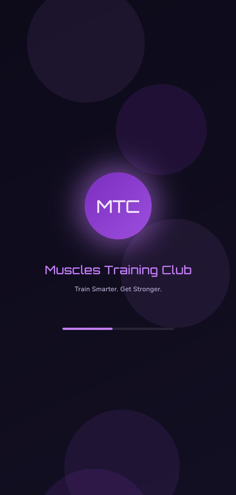
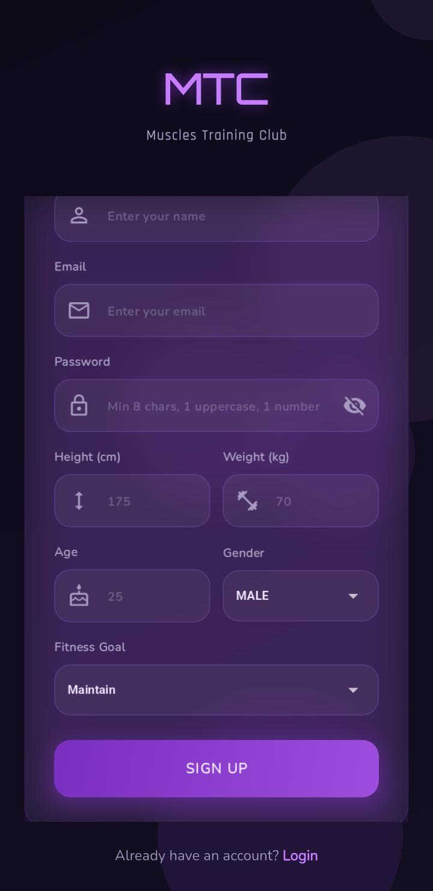
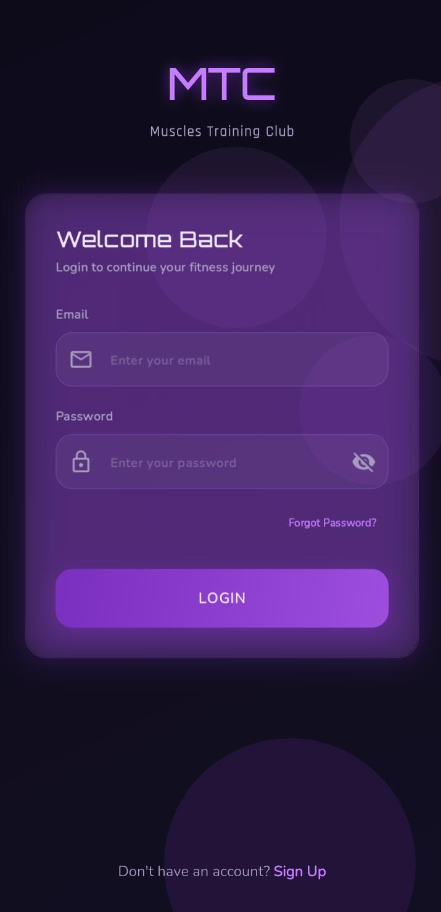
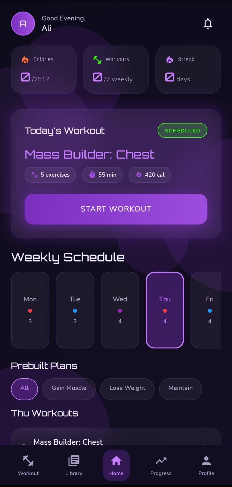
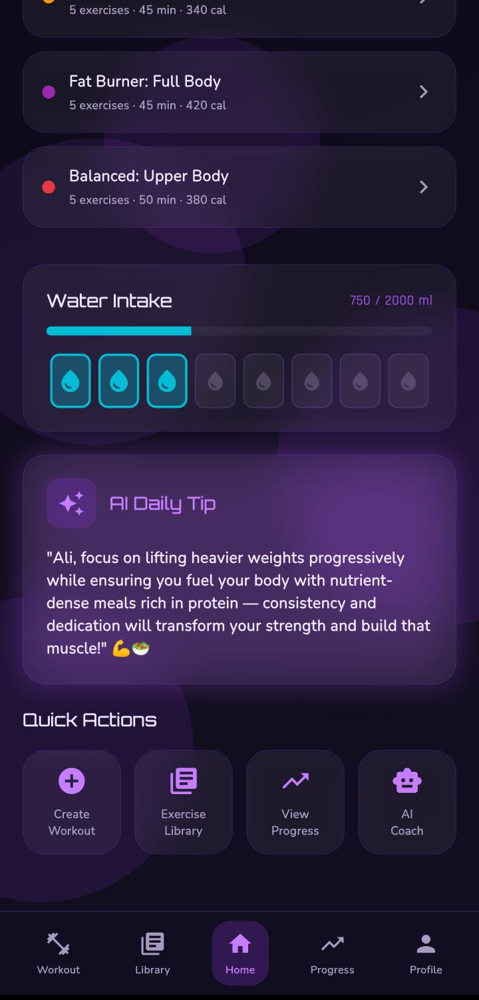
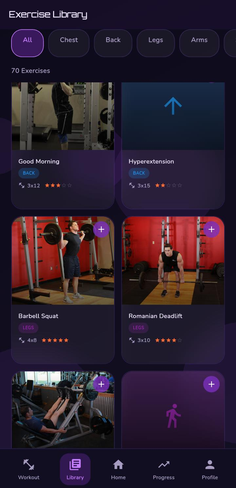
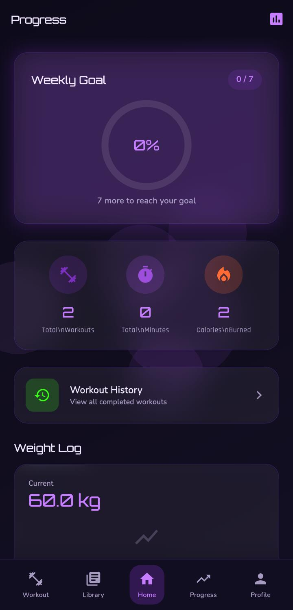
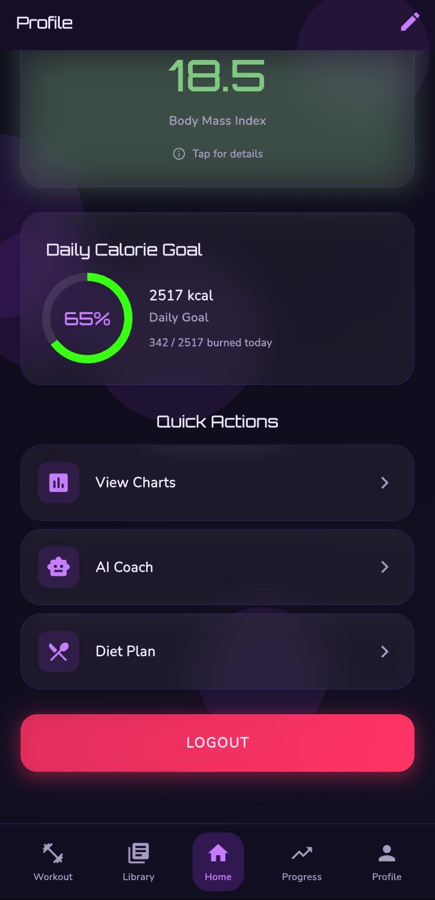

## 💪 Muscular Training Club

A premium AI-powered fitness application built with Flutter and Firebase. The app combines intelligent workout planning, real-time exercise tracking, and AI coaching into a single platform with a stunning glassmorphism UI.

## 🔐 Authentication
 > Email and password login with Firebase Auth
 > Secure account creation with form validation
 > Password reset via email link
 > Persistent sessions across app restarts

## 🏠 Home Dashboard
 > Horizontal 7-day workout calendar with color-coded muscle groups
 > One-tap workout start for today's scheduled session
 > AI-generated daily fitness tips personalized to user goals
 > Water intake tracker with circular progress indicator
 > Quick stats showing weekly calories burned and workout count
 > AI plan feed showing pending and active plans with accept/reject controls

## 📅 Workout Planner
  15 prebuilt workout plans across three categories:
 > Gain Muscle: Chest, Back, Legs, Arms, Shoulders mass builders
 > Lose Weight: HIIT Cardio, Full Body, Core & Cardio
 > Maintain: Upper Body, Lower Body, Full Body, Active Recovery
 > Custom plan creation and editing tools
 > Weekly calendar assignment with drag-and-drop functionality
 > Rest day marking for recovery scheduling

## ⏱️ Active Workout Session
 > Live elapsed time counter during exercise
 > Tap-to-increment set and rep counters with haptic feedback
 > Automatic rest timer between sets (60-90 seconds)
 > Per-set weight logging with historical tracking
 > Mid-session exercise replacement capability
 > Real-time calorie burn calculation using MET values
 > Pause, resume, and finish controls with full session history save

## 📚 Exercise Library
 > 70+ exercises across 7 muscle groups: Chest, Back, Legs, Arms, Shoulders, Core, Cardio
 > Search functionality by exercise name or muscle group
 > Detailed step-by-step instructions with form tips
 > Custom exercise addition to personal database
 > Visual muscle group identification icons

## 🤖 AI Coach
 > GPT-4 powered fitness coaching through OpenRouter API
 > One-tap quick prompts for common fitness questions
 > Personalized responses using BMI, goals, and workout history
 > Markdown-formatted responses with tables and lists
 > Persistent conversation history storage

## 🎯 AI Workout Generator
> Configurable parameters: training days (2-6), fitness level, goals
> AI-generated custom plans with specific exercises, sets, reps, and rest periods
> Markdown-formatted plan preview
> Firebase storage with pending status for user review
> Automatic weekly calendar integration upon acceptance

## 🥗 AI Diet Planner
 > Calorie targets calculated from user profile data
 > Protein, carbohydrate, and fat macro balancing
 > Full meal planning: breakfast, lunch, dinner, and snacks
 > Specific portion guidance in grams and ounces
 > Firebase storage with acceptance workflow

## 📊 Progress Tracking
 > Daily weight entry logging with date-stamped history
 > Complete workout session records with full statistics
 > Interactive fl_chart visualizations:
 > Weight progression line charts
 > Workout frequency bar charts
 > Calorie burn trend analysis
 > Automatic personal record tracking for lifts
 > Consecutive workout day streak counter
 > Body measurement logging: chest, arms, waist, thighs

## 👤 User Profile
 > Automatic BMI calculation with color-coded category display
 > Categories: Underweight, Normal, Overweight, Obese
 > Goal selection: Gain Muscle, Lose Weight, Maintain
 > Daily calorie target configuration (automatic or manual)
 > Body statistics tracking: height, weight, age, gender
 > Profile photo upload through Firebase Storage
 > Full profile editing capabilities
 > 💧 Water Tracker
 > Default 2500ml daily goal with customization option
 > Quick-add buttons: +250ml and +500ml
 > Animated circular progress indicator
 > Daily intake history log
 > Cloud synchronization through Firestore

 ## Project Structure 

 📦 muscles_training_club
 
📦 muscular_training_club/
│
├── 📁 lib/
│   │
│   ├── 📁 core/
│   │   ├── constants/
│   │   │   └── app_colors.dart          ← Colors
│   │   │
│   │   └── widgets/
│   │       ├── animated_background.dart  ← ← ← BUBBLES YAHAN HAIN
│   │       ├── glass_card.dart           ← Glass UI
│   │       └── gradient_button.dart      ← Buttons
│   │
│   ├── 📁 models/
│   │   └── user_model.dart               ← User data
│   │
│   ├── 📁 services/
│   │   ├── ai_service.dart               ← OpenRouter API
│   │   └── auth_service.dart             ← Firebase Auth
│   │
│   ├── 📁 providers/
│   │   └── auth_provider.dart            ← Login state
│   │
│   ├── 📁 screens/
│   │   │
│   │   ├── auth/
│   │   │   └── login_screen.dart         ← Login
│   │   │
│   │   ├── home/
│   │   │   ├── home_screen.dart          ← Bottom nav
│   │   │   └── home_tab.dart             ← Dashboard
│   │   │
│   │   ├── workout/
│   │   │   └── active_workout_screen.dart ← Timer + bubbles
│   │   │
│   │   ├── ai/
│   │   │   └── ai_coach_screen.dart      ← Chat
│   │   │
│   │   └── profile/
│   │       └── profile_screen.dart       ← User info
│   │
│   └── main.dart                         ← App start
│
├── 📁 assets/
│   └── images/                           ← App images
│
└── pubspec.yaml                            ← Packages

## 📦 Package Usage 

# Firebase
  firebase_core: ^2.27.0
  firebase_auth: ^4.17.0
  cloud_firestore: ^4.15.0
  firebase_storage: ^11.6.0
  
  # State Management
  provider: ^6.1.2
  
  # UI & Design
  google_fonts: ^6.2.1
  flutter_animate: ^4.5.0
  shimmer: ^3.0.0
  
  # Charts
  fl_chart: ^0.67.0
  
  # Animations
  lottie: ^3.1.0
  
  # Navigation
  go_router: ^13.2.0
  
  # Network
  http: ^1.2.0
  dio: ^5.4.1
  
  # Storage
  shared_preferences: ^2.2.3
  
  # Utils
  intl: ^0.19.0
  uuid: ^4.3.3
  
  # Image
  image_picker: ^1.0.7
  cached_network_image: ^3.3.1
  flutter_markdown: ^0.7.7+1
  flutter_launcher_icons: ^0.14.4

  
  
  
  
  
   
  
  
